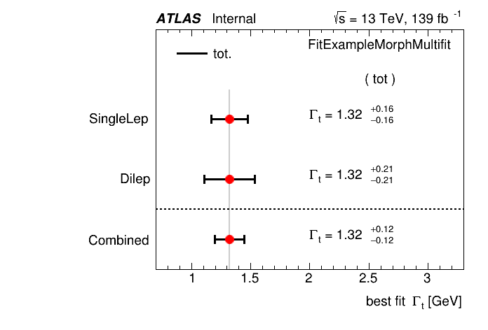
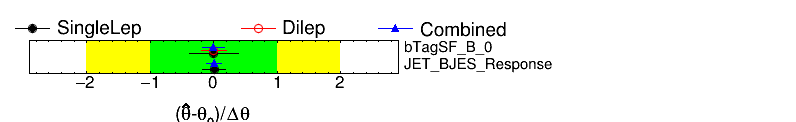
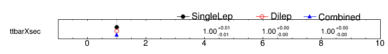

# Using Multifit

`TRExFitter` provides a convenient way how to compare and combine workspaces and results for individual config files.
This may be relevant, e.g. for combination/comparison of different channels of a single process.
This so-called "multifit" functionality requires to write a simple config file that includes the individual config files and provides additional steering arguments.

We will use config file that is used for our CI tests as an example.
The config file for the multifit setup can be found here: `test/configs/FitExampleMorphMultifit.config`

As you can see, the config file includes two separate config files: `test/configs/FitExampleMorphing.config` and `test/configs/FitExampleMorphingDilep.config`
Before we look into the functionalities of the multifit, make sure to run the `hwf` steps for both of the individual configs:

```bash
trex-fitter hwf test/configs/FitExampleMorphing.config
trex-fitter hwf test/configs/FitExampleMorphingDilep.config
```

## Multifit for comparisons
Firstly, let's have a look how to compare the results of multiple individual fits, without running their combination.
To compare the results, simply run:

```bash
trex-fitter m test/configs/FitExampleMorphMultifit.config
```

The code will _not_ run any combination of workspaces or fit combination, it will simply make some plots for comparison.
You can find the comparison of POIs in `POI_topWidth_.png`, comparison of pulls in `NuisPar_comp` and comparison of non-POI normalisation factors in `NormFactors_comp`.
You can control what is compared via: `ComparePOI`, `ComparePulls` and `CompareLimits` options, just make sure that `Compare` is set to `TRUE`.

As you can see, this is a convenient way to compare results, not necessarily for fits that will be combined later.
Multifit can be used to e.g. compare different setups for one fit with different assumptions about systematic model.

## Multifit for combination
If you really want to combine the results of individual fit, you need to make sure the `Combine` option is set to `TRUE` and then run the usual `w` and `f` steps:
```bash
trex-fitter mw test/configs/FitExampleMorphMultifit.config
trex-fitter mf test/configs/FitExampleMorphMultifit.config
```

!!! warning "Correlation of parameters"
    It is crucial to check the names of the parameters (inluding NuisanceParameters) of the individual fits. The standard HistFactory logic is applied, systematic uncertainties with the same name are 100% correlated in the workspace and the fit. Thus, it is important to use exactly the same names for the systematic uncertainties in the individual config files, if you wish to correlate them.

Running the `w` step will properly combine the individual workspaces and the `f` step will run the fit on the combined workspace.
Since in the example both `Combine` and `Compare` are set to `TRUE`, what you will see after running the `f` step that the results of the combined with will be compared with the results of the individual fits.
You can also choose to plot the combined correlation matrix by setting `PlotCombCorrMatrix: TRUE`.

This is how the comparison of POIs looks


This is the comparison of non-POI normalisation factors


And this is the comparison of the pulls


Standard features, that you are familiar with from the single fits, are also available, like LikelihoodScan (will produce a plot comparing the LikelihoodScans when `Compare` is set to `TRUE`), or producing ranking plot from the combined fit running `mr` step (also supports the standard command like option `Ranking=XXX`).

!!! hist "Two-mu fits"
    Usually, when we combine the fits we provide the same name for the POIs in the individual configs, treating them as one parameter in the fit. However, it is often useful to do so-called "two-mu" fits where the POIs name of the input single configs (in this examples just two of them) have different names, while keeping the names of systematics the same. This allows to get the results for the POI assuming they are not correlated, while systematic uncertainties are correlated. This can then further be used to check compatibility of the results in each channel.
