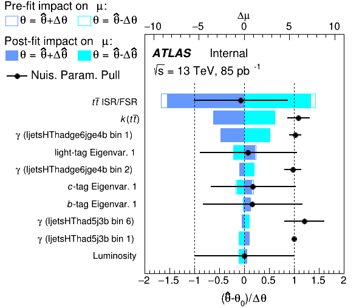

# Nuisance parameter ranking

In a fit with many nuisance parameters (NPs), it is interesting to know which matter the most.
To answer this question, we first need to come up with a way of quantifying how much a given NP "matters".
There is no unique way to do this, but two commonly used approaches are discussed here and on the [grouped impact page](grouped_impact.md).

## Impact of a nuisance parameter

The impact $\Delta \mu$ of a nuisance parameter $\theta$ on the parameter of interest (POI) $\mu$ is given by the shift in the POI between the nominal fit and another fit where the nuisance parameter is fixed to a value $\hat{\theta} \pm x$.
The value $\hat{\theta}$ is the maximum likelihood estimator of the nuisance parameter (or "post-fit value" of the NP).

- When $x=\Delta \theta = 1$, the resulting impact $\Delta \mu$ is called the *pre-fit impact*.
Here, $\Delta \theta = 1$ describes the uncertainty of $\theta$ as used for constrained nuisance parameters that add a unit Gaussian term to the likelihood.
For unconstrained nuisance parameters the pre-fit impact is not defined.

- For $x=\Delta \hat{\theta} \leq 1$, the resulting impact is called the *post-fit impact*.
$\Delta \hat{\theta}$ is the uncertainty of $\hat{\theta}$.
As nuisance parameters can be constrained, the post-fit impact can be smaller than the pre-fit impact.

## Producing a ranking plot

A ranking plot summarizes the pre- and post-fit impact of nuisance parameters, listed in the order of their impact on the POI.
In measurements with more than one POI, you can create a ranking plot for each POI.
To create such a plot, make sure that you have already performed a normal fit (with the `f` action).
Then run the `r` action via

```bash
trex-fitter r <config>
```

where `<config>` points to your configuration file.
If your model has many nuisance parameters, this step will take a long time (four fits are needed per nuisance parameter!).
In such a case it might make sense to parallelize the computation.
You can do this by specifying the name of the nuisance parameter you would calculate the impact for, using the `Ranking` command line argument:

```bash
trex-fitter r <config> Ranking=Luminosity
```

This will run the impact calculation only for the `Luminosity` NP and then save the results in `Fits/NPRanking_Luminosity.txt`.
Instead of specifying the NP by name, you can also do it via an index, `0` will use the first nuisance parameter in your configuration file.
If you decide to parallelize this, make sure to run the ranking for all nuisance parameters.
To collect all the information from the various files, in the end run the following:

```bash
trex-fitter r <config> Ranking=plot
```

The plot will be called `Ranking` (in the file format you specify in your config via `ImageFormat`).
To control the amount of parameters shown in the plot, use the option `RankingMaxNP`.
`RankingPlot` is used to control what to include: `"Syst"` excludes so-called gammas (encoding MC statistical uncertainty), `"Gammas"` includes only gammas, `"all"` includes both.
The ranking plots of only non-gamma parameters and of only gamma parameters have their name appended by `"Syst"` and `"Gammas"` respectively.

## The ranking plot

If you worked through the [short walkthrough](../tutorials/short_walkthrough.md), you will have already seen a ranking plot.
It looked like this:



If not, here is the way to reproduce this figure:

```bash
trex-fitter nwfr config/ttH2015_ljets.config
```

where the configuration file is located within the `config/` folder of the TRExFitter repository.

!!! tip "Understanding the ranking plot"
    The nuisance parameters are ranked by decreasing impact.
    The empty blue and cyan rectangles show the pre-fit impact, with the nuisance parameters fixed to $\hat{\theta} \pm \Delta \theta$.
    The filled rectangles show the post-fit impact, with nuisance parameters fixed to $\hat{\theta} \pm \Delta \hat{\theta}$.
    On the upper axis, the impact $\Delta \mu$ is shown.
    The lower axis shows the nuisance parameter pull $(\hat{\theta} - \theta_0) / \Delta \theta$.
    The pull is comparing the best-fit value to the nominal pre-fit value $\theta_0$, with the difference divided by the pre-fit uncertainty.

The ranking plot does not show the POI uncertainty due to data statistics.

## Hands-on

Let's take a closer look at the content of the plot we just produced.
Take a look at `Fits/NPRanking.txt`: it lists all the relevant results from the fits performed during ranking.
There is one row per nuisance parameter.
Here is an example from it:

```
tt_Rad_HiLow   -0.0748912 +0.938845 -0.938845  -8.53113   7.41587  -9.15381   7.82373
```

In each row, the information contained is:

- nuisance parameter name
- best-fit value $\hat{\theta}$
- uncertainty $\Delta \hat{\theta}$ (two numbers, for up and down)
- post-fit impact $\Delta \mu$ (first for $\hat{\theta} + \Delta \hat{\theta}$, then for $\hat{\theta} - \Delta \hat{\theta}$)
- pre-fit impact $\Delta \mu$ (first for $\hat{\theta} + \Delta \theta$, then for $\hat{\theta} - \Delta \theta$)

As an exercise, let's try to reproduce the post-fit impact for this parameter by hand, running a fit with the `f` action.
How can we do this?
You can look at the available options for the `Fit` block in the [settings](../settings.md#fit-block-settings).
The field below can be opened to contain the answer.

??? question "How to reproduce the post-fit impact?"
    Use the `FixNPs` setting.
    First, let's calculate what happens when we fix the parameter to $\hat{\theta} + \Delta \hat{\theta}$.
    From the excerpt above (or alternatively, from `Fits/ttH2015_ljets.txt`) we see that $\hat{\theta} + \Delta \hat{\theta} = -0.0748912 + 0.938845 = 0.8639538$.
    We need to fix the NP to this setting, using `FixNPs: alpha_tt_Rad_HiLow:0.8639538`.
    The best-fit POI value can be found in `Fits/ttH2015_ljets.txt`: `SigXsecOverSM  -12.9625 +8.94936 -8.61858` (the numbers are the best-fit value, followed by the uncertainty in up/down direction).
    The first number is the best-fit value.
    Now let's repeat this for the variation in the other direction, $\hat{\theta} - \Delta \hat{\theta} = -0.0748912 - 0.938845 = -1.0137362$.
    The corresponding result is `SigXsecOverSM  2.98448 +8.92478 -6.83969`.
    The last thing we need is the best-fit value of the POI from our nominal fit (without any nuisance parameters held fixed), which is `SigXsecOverSM  -4.43139 +11.5994 -11.6852`.
    Putting those numbers together, the post-fit impact in the "up" direction is $-12.9625 - (-4.43139) = -8.53111$.
    In the "down" direction it is $2.98448 - (-4.43139) = 7.41587$.
    This exactly reproduces the numbers determined by the ranking.
