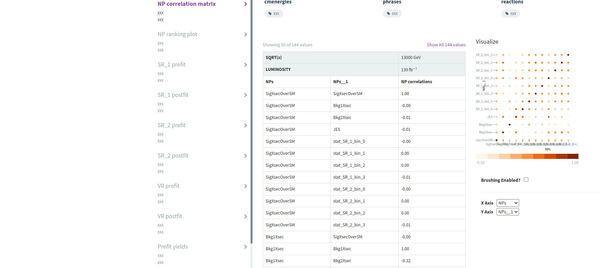
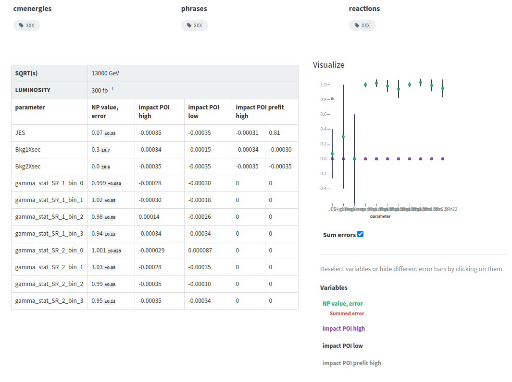
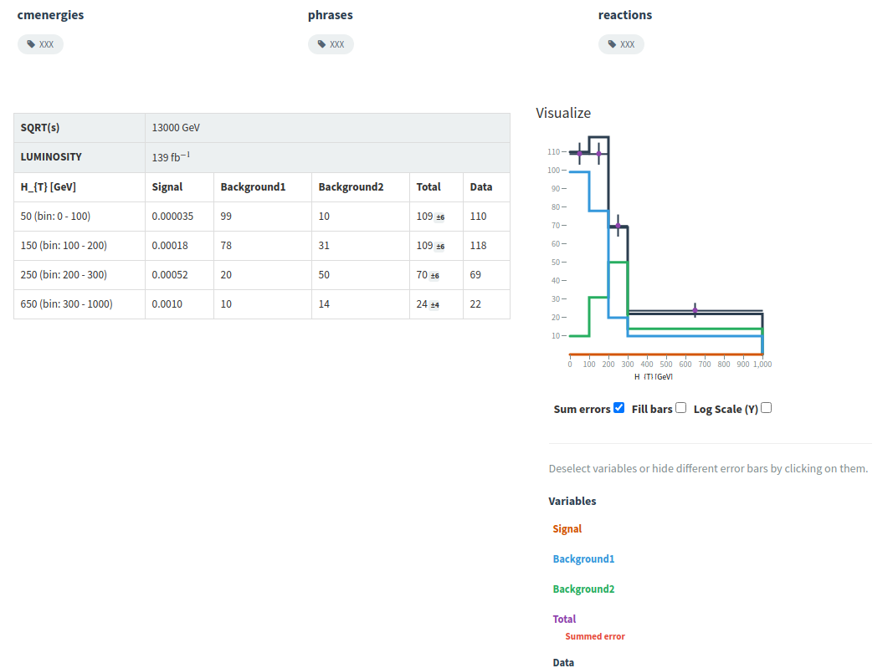
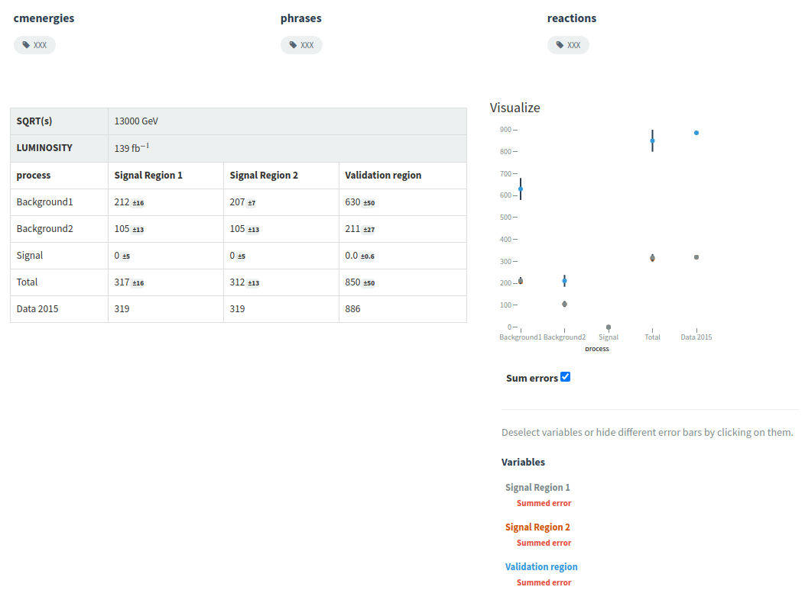

# HEPData format

In many analyses (ideally in all) it is important to provide the results in [HEPData](https://www.hepdata.net/) format.
This common format for theorists and experimentalists is based on [yaml](https://yaml.org/).
Usually, some scripts/custom code needs to be written to transform the results from standard ROOT or plain text format into the proper HEPData yaml format.
Recently, we implemented an option in `TRExFitter` that produces the proper format needed by HEPData.

## Producing HEPData format

Let us test this new feature using a simple config file that is used for CI tests.

Add the following option: `HEPDataFormat: TRUE` to the `JOB` block of `test/configs/FitExample.config` and run the usual steps of the analysis

```
trex-fitter hwfrdp test/configs/FitExample.config
```

Now, look at the output folder for HEPData in `FitExample/HEPData/` folder.
You should see multiple yaml files representing different outputs: `Correlation.yaml` for the NP correlation matrix, `Ranking.yaml` for the ranking plot, `Table_prefit.yaml` and `Table_postfit.yaml` for the pre/post fit yields tables and, finally, one yaml file for each region pre/post fit.
You can inspect these files.
Additionally, `submission.yaml` file is created.
This is the main steering file that is used by HEPData.
You can see that there are many `XXX` comments, this is something which needs to be replaced by the analysers before the actual submission.

Nevertheless, even with the current files, you can try to compress them together and submit to the [HEPData sandbox](https://www.hepdata.net/record/sandbox) (you need to create an account there).
After few second you should be able to see some nice visualisations of the provided tables.

??? hint "Screenshots from HEPData"
    
    
    
    
