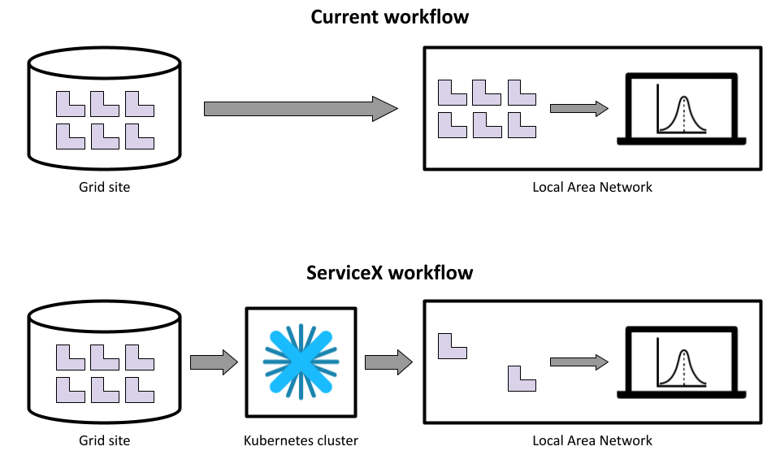
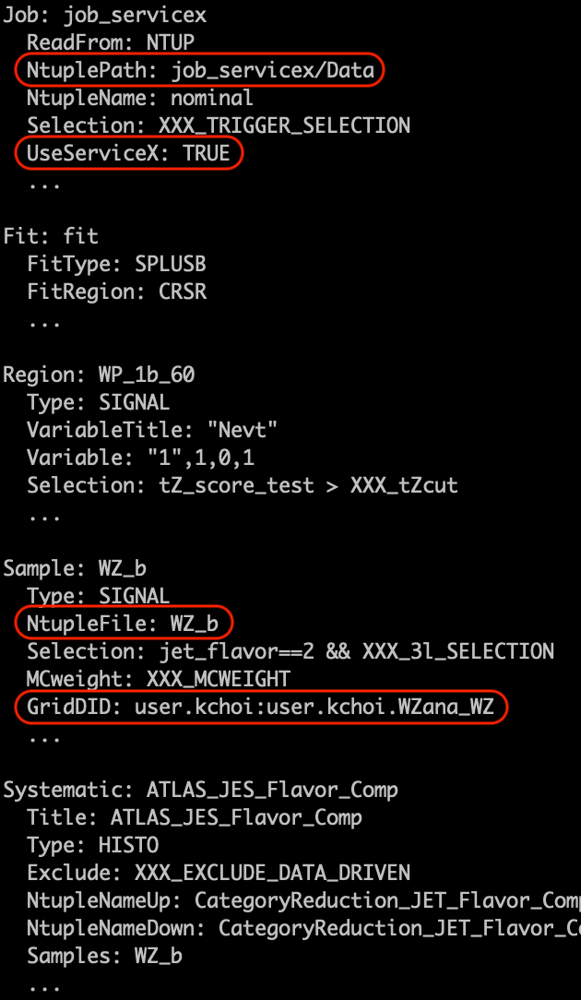
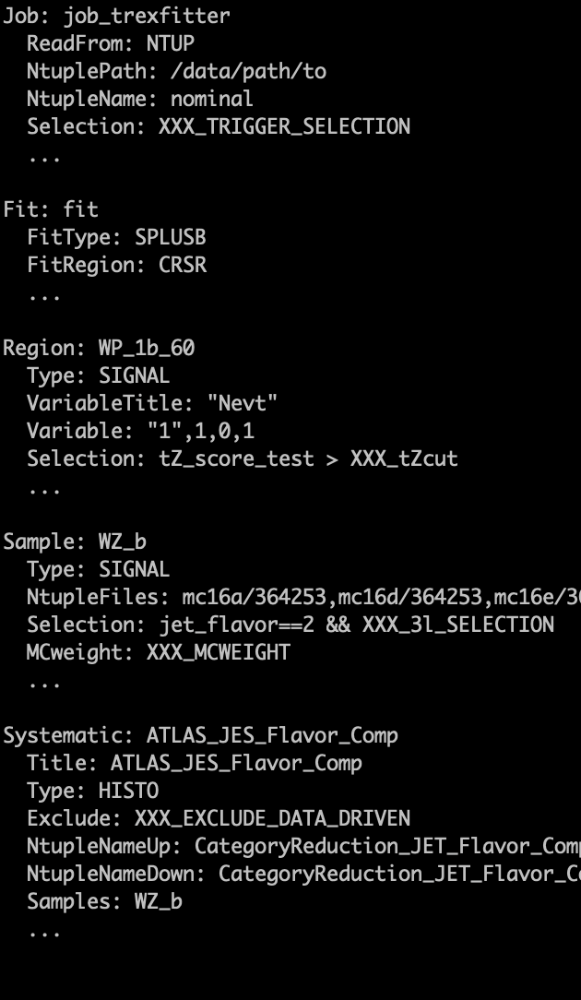

# `ServiceX` for `TRExFitter`

*This page describes an experimental feature, which at the moment is not fully supported.*

[ServiceX](https://servicex.readthedocs.io) is an on-demand data delivery system.
It reads `ROOT` ntuples from the grid, and performs slimming and skimming on the fly, and delivers only requested branches and entries to a user as a format of `ROOT` ntuple.
ServiceX runs on any Kubernetes cluster, and workers (or pods) can be easily parallelized due to the auto-scaling feature of Kubernetes.

[`servicex-for-trexfitter`](https://github.com/kyungeonchoi/ServiceXforTRExFitter) is a Python package to integrate `ServiceX` into the `TRExFitter` framework.
It provides an alternative workflow if you use `ROOT` ntuples as inputs.
The package analyzes your `TRExFitter` configuration file, and delivers only necessary branches and entries to produce all histograms defined in your `TRExFitter` configuration file.

The default workflow requires to download all `ROOT` ntuples to your local machine or CERN EOS area from the grid.
The workflow using `servicex-for-trexfitter`, on the the other hand, delivers only a subset of `ROOT` ntuples.
It practically replaces the step to download `ROOT` ntuples from the grid using `Rucio`.



The main advantages are:

- Disk space: No need to store all `ROOT` ntuples locally.
A reduction on the delivered `ROOT` ntuples by `servicex-for-trexfitter` varies accoring to the setting in your `TRExFitter` configuration file.
- Faster turnaround: Download of `ROOT` ntuples can be faster for `servicex-for-trexfitter` as it parallelizes your job up to each `TTree` of each file and delivers smaller `ROOT` ntuples over WAN.
Processing time of `TRExFitter` option `n` is naturally faster for the workflow using `servicex-for-trexfitter` as it runs over smaller `ROOT` ntuples.
- Simplicity: A single `TRExFitter` configuration file to get `ROOT` ntuples from the grid using `servicex-for-trexfitter` and all other `TRExFitter` steps. No separate script needed to download all `ROOT` ntuples from the grid.

## Prerequisites

- Python 3.6 or higher
- [PyROOT](https://root.cern/manual/python/)
- Access to an *Uproot* `ServiceX` endpoint

### Getting an access to an *Uproot* ServiceX endpoint

`ServiceX` can be deployed on any Kubernetes cluster and thus you can use any *Uproot* `ServiceX` endpoint to run `servicex-for-trexfitter`.
There is the centrally-managed *Uproot* `ServiceX` instance, which is deployed at the University of Chicago's SSL River Kubernetes Cluster.

#### Obtaining credential at UC River cluster

Visit the URL `https://uproot-atlas.servicex.ssl-hep.org` in a browser and click the sign in button at the right corner to create an account.
You can authenticate with the identity provider of your choice (CERN SSO is recommended!).


You will receive a welcome email once your account is approved.
Now you can create the `servicex.yaml` file with the token to access the *Uproot* `ServiceX` endpoint at River cluster:
```bash
api_endpoints:
  - endpoint: https://uproot-atlas.servicex.ssl-hep.org/
    token: <omitted>
    type: uproot
```

You can put the `servicex.yaml` file in your home directory or working directory.

## Installation

```bash
pip install servicex-for-trexfitter
```

## Prepare `TRExFitter` configuration file

The followings are the settings needed for the workflow using `servicex-for-trexfitter`:

#### `Job` block settings

- `NtuplePath: <PATH>/Data`
    - The path you want to deliver input `ROOT` ntuples using `servicex-for-trexfitter`.
It will be also used as an input path when running `TRExFitter` step `n`.
- `UseServiceX: TRUE`
    - An option when reading input `ROOT` ntuples delivered using `servicex-for-trexfitter`.

#### `Sample` block settings

- `GridDID: <Rucio DID>`
    - An option defines a `Rucio` data identifier for each `Sample`.
You need to specify both scope and name, e.g., `user.kchoi:user.kchoi.WZana_WZ`.
- `NtupleFile: <SAMPLE NAME>`
    - `servicex-for-trexfitter` delivers one `ROOT` file per `Sample` with the same name as the `Sample` name.
Thus, `NtupleFile` needs to be identical to the `Sample` name.

Here is a side-by-side comparsion of example configuration files:

`servicex-for-trexfitter` | Default
:--------:|:------:
 | 

## Usage

### Deliver `ROOT` ntuples using `servicex-for-trexfitter`

```python
from servicex_for_trexfitter import ServiceXTRExFitter
sx_trex = ServiceXTRExFitter("<TRExFitter configuration file>")
sx_trex.get_ntuples()
```

Once you load the package, you can define an instance with an argument of `TRExFitter` configuration file.
You can then ask for delivery of `ROOT` ntuples.
It will initiate `ServiceX` transformation(s) based on your `TRExFitter` configuration, and deliver `ROOT` ntuples to the path you specified at `Job/NtuplePath`.

### Local data cache

`ServiceX` provides the feature that caches your queries and data into a local temporary directory.
Therefore, whenever you make further changes to the `TRExFitter` configuration file, `servicex-for-trexfitter` creates data delivery requests only for the updated parts.

### Compatible TRExFitter framework

To run the subsequent steps of `TRExFitter` with the `ROOT` ntuples that `servicex-for-trexfitter` delivered, you need to checkout the branch `feat/servicex-integration` of `TRExFitter` framework.
Otherwise, `TRExFitter` will complain about the unknown options.
The feature branch will be merged into master in the near future.

## Caveats

### Limited support for `Selection` expression

`ServiceX` utilizes [`func-adl`](https://github.com/iris-hep/func_adl), a python-based declarative analysis description language, to filter events and request branches from the input `ROOT` ntuple.
Since `TRExFitter` uses `TTreeForumla` for `TTree` selections, the python package [`tcut-to-qastle`](https://github.com/ssl-hep/TCutToQastleWrapper) is written to translate `TTreeFormula` expression into `func-adl`.
It supports many of expressions but there are some missing expressions.

Supported expressions:

- Arithmetic operators: `+, -, *, /`
- Logical operators: `!, &&, ||`
- Relational and comparison operators: `==, !=, >, <, >=, <=`
- Mathematical function: `sqrt`

Unsupported expressions:

- Ternary operation
- Special `ROOT` functions such as `Entry$, Sum$(formula)`

<details>
  <summary markdown="span">Example selection expression</summary>
  ```
  (lep_isTrigMatch_0||lep_isTrigMatch_1||lep_isTrigMatch_2) &&  ( (abs(lep_ID_0)==11 && lep_isolationFCLoose_0&& lep_promptLeptonVeto_TagWeight_0<-0.3 &&lep_ambiguityType_0==0) || (abs(lep_ID_0)==13 && lep_isMedium_0 && lep_isolationFCLoose_0 && lep_promptLeptonVeto_TagWeight_0<-0.3 && lep_ambiguityType_0 == 0) )&&( (abs(lep_ID_1)==11 && lep_isolationFCLoose_1&& lep_promptLeptonVeto_TagWeight_1<-0.3 &&lep_ambiguityType_1==0) || (abs(lep_ID_1)==13 && lep_isMedium_1 && lep_isolationFCLoose_1 && lep_promptLeptonVeto_TagWeight_1<-0.3 && lep_ambiguityType_1 == 0) )&&( (abs(lep_ID_2)==11 && lep_isolationFCLoose_2&& lep_promptLeptonVeto_TagWeight_2<-0.3 &&lep_ambiguityType_2==0) || (abs(lep_ID_2)==13 && lep_isMedium_2 && lep_isolationFCLoose_2 && lep_promptLeptonVeto_TagWeight_2<-0.3 && lep_ambiguityType_2 == 0) )&& lep_promptLeptonVeto_TagWeight_0>-1.05 && lep_promptLeptonVeto_TagWeight_1>-1.05 &&  lep_promptLeptonVeto_TagWeight_2>-1.05 && nJets_OR==1 &&  trilep_type>0&&(lep_Pt_0>10e3&&lep_Pt_1>20e3&&lep_Pt_2>20e3)&&abs(total_charge)==1&&(((lep_ID_0==-lep_ID_1 && ((lep_ID_0==-lep_ID_1&&abs(Mll01-91.2e3)<10e3)))||(lep_ID_0==-lep_ID_2&&abs(Mll02-91.2e3)<10e3)))&&(lep_ID_0!=-lep_ID_1||(Mll01>12e3))&&(lep_ID_0!=-lep_ID_2||(Mll02>12e3))&&( ( (abs(lep_ID_0) == 13 &&lep_isMedium_0) ||( abs( lep_ID_0 ) == 11&&abs( lep_Eta_0 ) <2.0)) && ((abs( lep_ID_1 ) == 11&&abs( lep_Eta_1 ) <2.0)|| (abs(lep_ID_1) == 13 && lep_isMedium_1) ) && ((abs( lep_ID_2 ) == 11&&abs( lep_Eta_2 ) <2.0)||(abs( lep_ID_2 ) == 13 && lep_isMedium_2)))&&nJets_OR>0&&nJets_OR<3&&abs(Mlll012-91.2e3)>10e3&&met_met>20e3
  ```
</details>

### Mix-and-match

Mix-and-match is not supported at the moment.
All `Sample` blocks have to read `ROOT` ntuples from the grid using `GridDID`.
We are planning to support the feature that `Sample` can read either locally via `NtupleFile(s)` or from grid if `GridDID` presents.

## Future updates

The package is still evolving.
Further support, optimization, and stabilization are foreseen.

The repository for this development: [kyungeonchoi/ServiceXforTRExFitter](https://github.com/kyungeonchoi/ServiceXforTRExFitter)

Contributions or suggestions are very welcome! Please contact [kyungeonchoi@utexas.edu](mailto:kyungeonchoi@utexas.edu) or make an issue at the repo.
