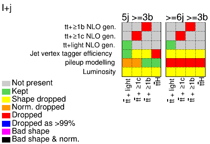

# Building an envelope from multiple NPs

For some sets of uncertainties it may be useful to combine them into a single NP.

!!! warning "Warning"
    This is a very dangerous assumption usually, as converting multiple NPs into a single one can severely underestimate the shape component of the individual variations. Thus, this should be used only for uncertainties that have small impact.

This can be done automatically within `TRExFitter` using options `CombineName` and `CombineType`.
If the same `CombineName` is added to the a group of systematic uncertainties, the first one will include the combination, while the other ones will be remove (pruned).
The `CombineType` for the first uncertainty can be set to `ENVELOPE` which will build bin-by-bin envelope (suggested to use symmetric individual inputs) or `STANDARDDEVIATION` that will take the standard deviation as an uncertainty bin-by-bin (`OneSided` symmetrisation for the individual inputs is suggested), this can be useful e.g. in the case of the NNPDF uncertainties.

The shape/norm dropping is first applied to the individual NP _before_ the combination.
If you want to drop the normalisation of the total envelope use the `DropNormSpecial` option.

Now let us test the options.
First, run produce the inputs using the config file used for the CI tests

```bash
trex-fitter n test/configs/FitExampleNtuple.config
```

Now, modify the config file and add the following lines for each systematic that you wan to combine: `CombineName: Combined` and `CombineType: ENVELOPE`

Now run the `b` step

```bash
trex-fitter b test/configs/FitExampleNtuple.config
```

followed with the `w` step

```bash
trex-fitter w test/configs/FitExampleNtuple.config
```

Now check the pruning plot.

??? hint "Pruning plot"
    

