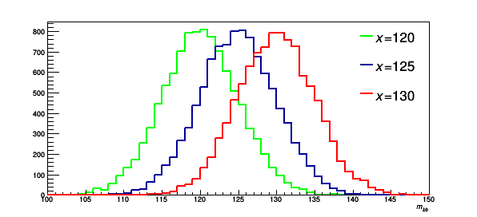
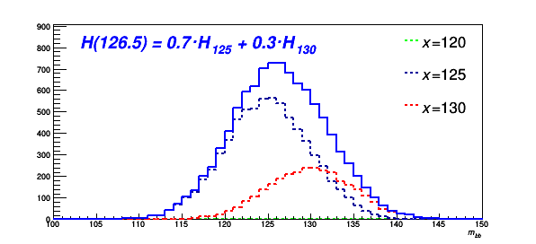

# Using multiple templates for profile likelihood fits

## Introduction

One of the limitations of the profile likelihood machinery, as implemented in `RooStats` and `HistFactory`, is that only three templates are allowed - nominal and $\pm 1 \sigma$.
However, in many measurements, multiple templates are compared to data to estimate a value of one or more parameters, e.g. top-quark mass or decay width.
In the case of these template fits, the meaning of the templates is also different.
The templates are not used to define a systematic uncertainty but rather represent distributions for different underlying values of a given parameter.

An obvious question arises, can measurements that use multiple templates use the machinery built for profile likelihood fits?
The answer is: yes, with some modifications.

Since profile likelihood fits are designed for the extraction of the normalisation of a given distribution, the problem of fitting multiple templates needs to be translated to the normalisation fitting problem.
This is done by simple _morphing_ that interpolates between templates, where each templates get assigned a normalisation, `w`, that is a function of the Parameter Of Interest, `w(POI)`.
The simplest interpolation uses piece-wise linear interpolation between the templates.
Let $S_i$ be the total number of events in bin $i$, then

$$
S_i = \sum_t w^t_i(POI) \cdot T^t_i,
$$

where $T_i^t$ is the number of events in bin $i$ for template $t$.

As an example, assume we have 3 templates for top-quark mass representing 172, 173 and 174 GeV.
Now let us assume that the "real" value of the mass is 172.5 GeV.
The fit should converge to a result where both templates representing 172 and 173 are fitted to 0.5 the original normalisation and the template representing 174 GeV will not contribute at all (normalisation is zero).
This provides clear interpretation of the interpolation which can be summarised as "172.5 GeV is 0.5 times 172 GeV and 0.5 times 173 GeV".

Another example is shown below where templates representing the Higgs mass are displayed.
The templates have values of 120, 125 and 130 GeV.


Now assume the true mass of the Higgs boson is 126.5 GeV, the plot below shows how this is combined from the available templates.


For more information check these [slides](https://docs.google.com/presentation/d/1JXqoJxhRh6hexLaM_XsWdNF7S0MPhVFEOzBGXU8QLzs/edit#slide=id.g4b04c811c5_0_159).

## Example - Top quark decay width

As an example, let us look at the configuration file that is a simplified version of measurement of the top quark decay width that is used in the `TRExFitter` CI tests.
The config file is located at `test/configs/FitExampleMorphing.config`.
The measurement uses two regions (distributions), where one is sensitive to the decay width value (signal region), while the other is not (control region).

### Fit block

In the `Fit` block of the config file, a new option `TemplateInterpolationOption` can be used to set the formulas used for the interpolation between the templates.
The default option is `LINEAR`, which uses piece-wise linear interpolation.
Other options exist as well, documented in [Settings](../settings.md#fit-block-settings), that give approximate formulas that converge to the piece-wise linear interpolation.

### Sample blocks

Notice the definition of the `GHOST` sample called `Nom_lep`, this represents the signal distribution for the nominal prediction of decay width (1.32 GeV).
This is needed for the next steps as you will see.

Definition of the width templates is done at the `Sample` level, e.g.

```yaml
Sample: "Signal_0p7"
  Type: SIGNAL
  Title: "t#bar{t}"
  FillColor: 0
  LineColor: 1
  HistoFile: "ttbar"
  HistoName: "nominal/width_0p7/reco_mlb150"
  Morphing: "topWidth",0.7
  Regions: SR_lep
```

Notice the `Morphing` option, which tells the code that this sample should use the morphing interpolation and that the value for this given input is 0.7.
Similar definitions are present for values of 1.0, 1.5 and 2.0.

As you can see, the control region part is not special at all since there are no width templates.

### NormFactor

It is important to add the following lines for the parameter that is used for interpolation, in our case `topWidth`:

```yaml
NormFactor: "topWidth"
  Title: "topWidth"
  Nominal: 1.32
  Min: 0.7
  Max: 2.0
  Samples: none
```

It is important that `Samples: none` is used in this case.

As you can see from the config file, also the usual NormFactors can be added, in this case:

```yaml
NormFactor: "ttbarXsec"
  Title: "ttbarXsec"
  Nominal: 1
  Min: -10
  Max: 10
  Samples: Signal_0p7,Signal_1p0,Signal_1p5,Signal_2p0,Control_Wmass
```

which just controls the overall normalisation of the $t\bar{t}$ signal (including control region!).

### Systematic uncertainties

The systematic uncertainties on the templates are propagated from the nominal template, assuming that the relative impact on each template is the same.

!!! warning "Systematics"
    This may not be always true! In that case you need to define systematic uncertainties per template.

The uncertainties are defined with:

```yaml
Systematic: "bTagSF_B_0"
  Title: "bTagSF_B_0"
  NuisanceParameter: "bTagSF_B_0"
  Type: HISTO
  ReferenceSample: Nom_lep
  ReferencePruning: Signal_1p5
  Samples: Signal_0p7,Signal_1p0,Signal_1p5,Signal_2p0
  HistoFileUp: "ttbar"
  HistoFileDown: "ttbar"
  HistoNameUp: "weight_bTagSF_MV2c10_60_eigenvars_B_up_0/reco_mlb150"
  HistoNameDown: "weight_bTagSF_MV2c10_60_eigenvars_B_down_0/reco_mlb150"
  Symmetrisation: TwoSided
  Category: Btag
  Regions: SR_lep
```

Notice that the `GHOST` reference sample, representing the nominal width prediction, is used and the differences are then propagated to all width templates.
`ReferencePruning` can be used to keep the pruning consistent between the templates to avoid instabilities in the fit.

Now we need to add the same uncertainties to the control region where no width templates are present (this can be done similarly for backgrounds):

```yaml
Systematic: "bTagSF_B_0"
  Title: "bTagSF_B_0"
  NuisanceParameter: "bTagSF_B_0"
  Type: HISTO
  Samples: Control_Wmass
  HistoFileUp: "ttbar"
  HistoFileDown: "ttbar"
  HistoNameUp: "weight_bTagSF_MV2c10_60_eigenvars_B_up_0/reco_Whad_m_25bins"
  HistoNameDown: "weight_bTagSF_MV2c10_60_eigenvars_B_down_0/reco_Whad_m_25bins"
  Symmetrisation: TwoSided
  Category: Btag
  Regions: CR_Wmass
```

These two block of systematic uncertainties describe the same source, so they will be 100% correlated in the fit since the block use the same `NuisanceParameter`.

!!! tip "Check automatic systematic propagation"
    The above example is very descriptive, however, it may be more convenient to use the `PropagateSystsForMorphing` config option which will do the propagation of systematic uncertainties for the individual templates automatically.

### Running the fit

Try to run the fit using the usual commands, starting with the construction of the template histograms:

```bash
trex-fitter h test/configs/FitExampleMorphing.config
```

Check the output folder, you will find a new folder called `Morphing` which shows the different templates.

Now build a workspace and run the fit:

```bash
trex-fitter wf test/configs/FitExampleMorphing.config
```

The data in the config file represents MC prediction for the nominal width, so the fitted value should be close to 1.32 GeV, but it may not match it perfectly since the interpolation used is only an approximation. How good is the approximation based on the result?

All the standard functionalities of the code, like pre/post-fit plots or ranking also work with this option.

!!! tip "Multifit"
    Also the multifit option is supported for morphing, provided that the same template steps are used in the considered configurations. If you are interested in this, have a look at `test/configs/FitExampleMorphMultifit.config`.
