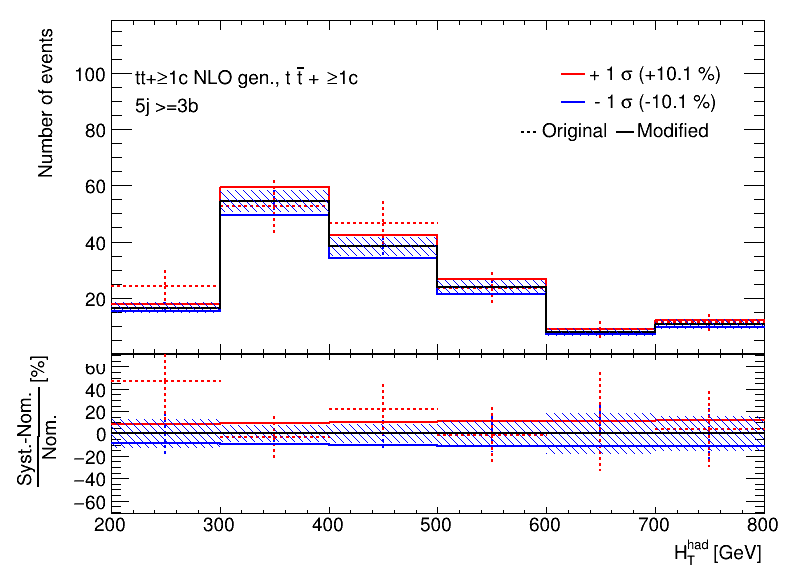
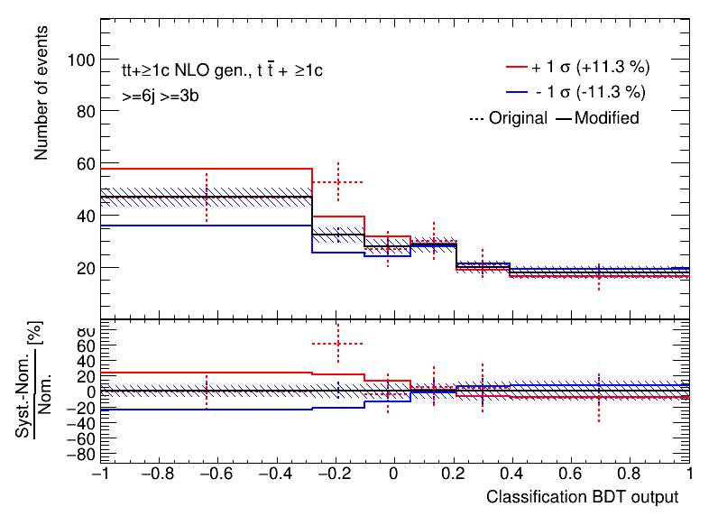
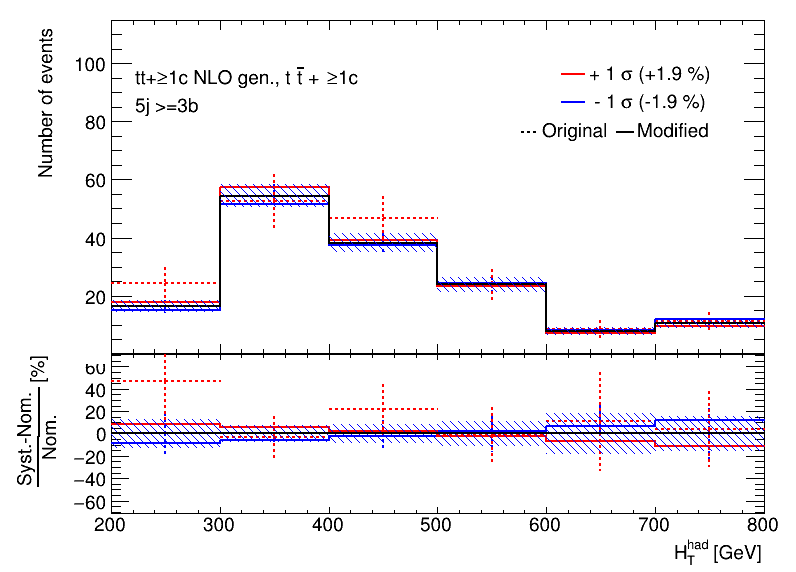
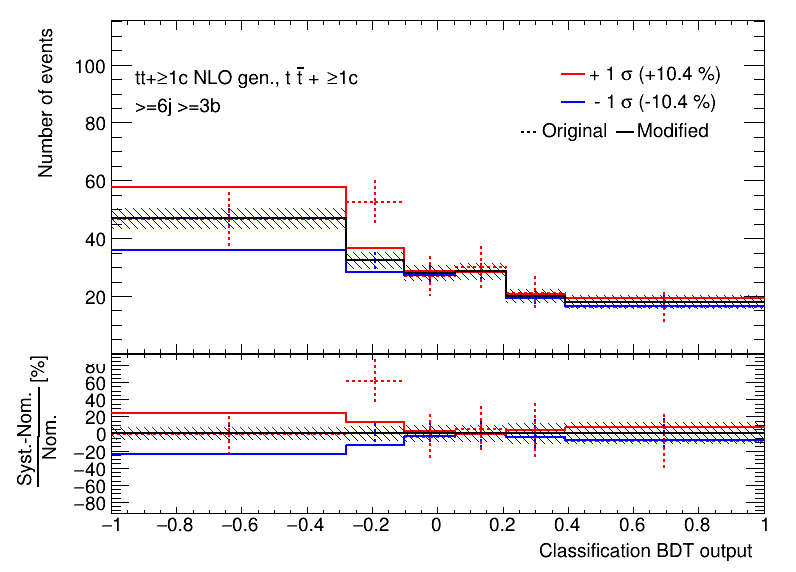
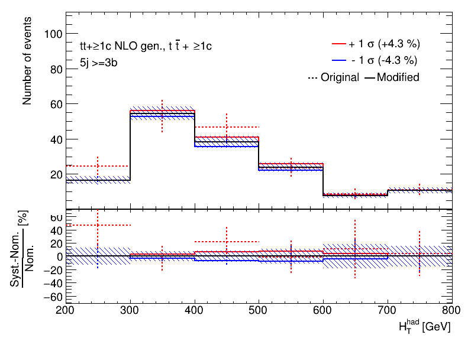
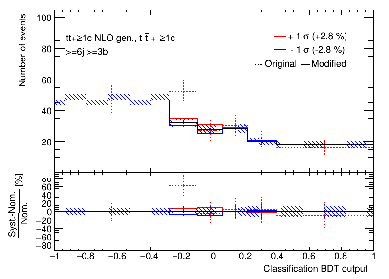

# Option to force a shape withing an error band by hand

## Introduction

It may sound a bit weird to modify a template for systematic uncertainty, which is exactly what will be discussed here.
However, for some systematic uncertainties this is a valid cross-check.
Some systematic uncertainties do not have good statistical interpretation, like the (in)famous 2-point systematics (e.g. Pythia vs Herwig).
The usual template(s) just gives an error band (defined by the difference between the nominal and the varied template) rather than a well defined shift.
Thus, in these cases, the definition of the uncertainty is not clear and several shapes within the error band can be tested to see how the result relies on a given shape.

### Example

Let us first produce some systematic uncertainty (red-blue) plots using the config file for the CI tests.

```bash
trex-fitter n test/configs/FitExampleNtuple.config
```

Now, focus on one particular uncertainty, `ttc_Gen`. You should see the plots below.

|  |  |
|---|---|

Focus on the shape of the up and down uncertainty.
Now modify the config file by adding the following line `ForceShape: LINEAR` to the `Systematic: "ttc_Gen"` block.
The option changes the original shape by doing linear interpolation from the leftmost-up variation to the rightmost-down variation.

Rerun the production of the histograms, using the `b` step (so you do not have to redo the `n` step)

```bash
trex-fitter b test/configs/FitExampleNtuple.config
```

You should now see different variations but still within the error band

!!! hint "This is a replacement of the uncertainty"
    Note that the original uncertainty is _replaced_.

|  |  |
|---|---|

Other supported option is the `TRIANGULAR` setting, which will set the shape to be zero at the rightmost and leftmost part, and will reach the error band in the middle.

|  |  |
|---|---|

!!! hint "The impact on the result"
    Try to run the fit with different shape options and see what happens to your result.
