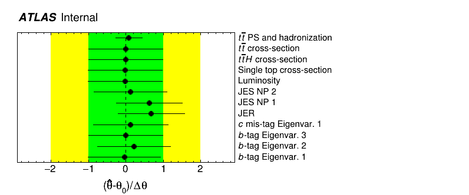
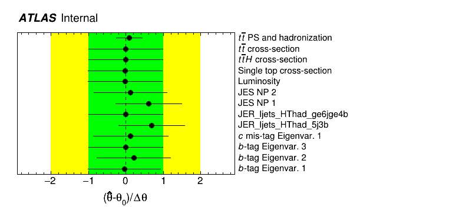
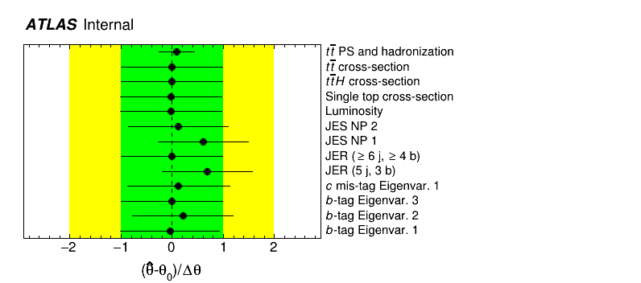
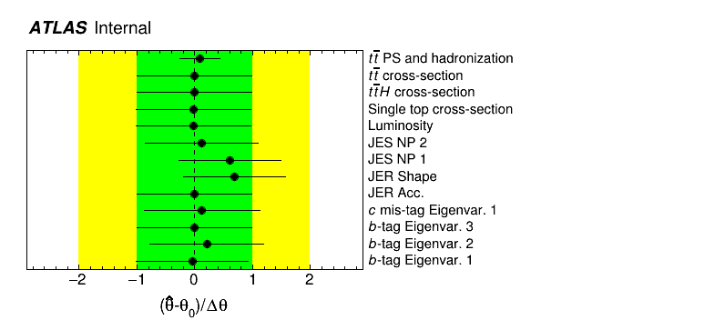
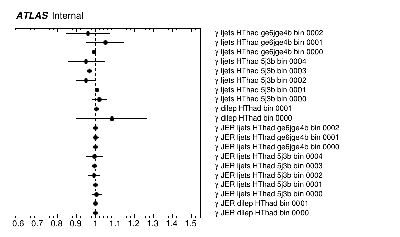

# Decorrelating systematics

It can often be useful to split systematic uncertainties acting on multiple samples or regions.
By decorrelating the uncertainty and using multiple nuisance parameters instead of a single one, it can become more evident what the cause for a pull or constraint are.
`TRExFitter` provides a few convenience features to help with this.
These methods can be used to study fit models, but whether decorrelation as the nominal approach makes sense or not is another question.
Have a look at the [ATL-COM-PHYS-2020-272](https://cds.cern.ch/record/2715689/) note: "Recommendations on the treatment of theoretical systematic uncertainties in statistical analysis of ATLAS data".

We will demonstrate them here with the example provided in `config/ttH_tutorial.config`.
To get started, perform a fit with this config:
```bash
trex-fitter nwf config/ttH_tutorial.config
```

You will see, among other things, a pull of the JER NP:


## Manually decorrelating

The JER systematic block looks as follow:
```yaml
Systematic: "JER"
  Title: "JER"
  Type: HISTO
  Samples: ttbar
  NtupleNameUp: "JET_JER_SINGLE_NP__1up"
  Smoothing: 40
  Symmetrisation: ONESIDED
  Category: Instrumental
  SubCategory: "jets-MET"
```

We only apply this systematic uncertainty on ttbar in this example, but use this single nuisance parameter for all regions.
If we wanted to split this into three nuisance parameters, one per region, we could duplicate the block three times, change the name of the systematic each time and use the `Regions` setting to assign each block to one of the three regions used in this config.
Try doing this and re-run the fit.
For this to work, you will have to re-run `nwf` - just reproducing the workspace is not enough, since histograms for the systematic with the new name (e.g. "JER_ljets_HThad_5j3b" will not be found).
There is a handy trick available to avoid having to re-run the `n` step: the `StoredName` option allows you to read existing histograms known with a different name.
In the example here, you can use `StoredName: JER` and just run `wf`.
The result looks as follows:


The JER NP does not appear in the dilepton channel, since it was pruned (check out the pruning plot `ttH_tutorial/Pruning.png`).
The pull originates from the 5j3b region in this case.

You can use this approach as well to decorrelate systematics between samples, by cloning the corresponding `Systematic` block and using the `Samples` setting.
We will continue with some more convenient options to use.

## More convenient methods

The `Decorrelate` option allows to decorrelate systematics in three ways by using the corresponding keywords:

- `REGION` to split per region (channel in HistFactory)
- `SAMPLE` to split between samples  the systematic acts on,
- `SHAPEACC` to split into two uncorrelated modifiers: one only changing shape (keeping normalization per region constant, implemented as a HistoSys modifier) and another one only changing normalization per region (a NormSys modifier).

Besides being quicker to implement than the manual approach outlined below, you additionally do not have to re-run `n`/`h`/`b`, but only have to reproduce the workspace (`w`) with this approach.
We will have a closer look at each of the three options.

### Decorrelation per region

This is equivalent to what we did manually above.
Add `Decorrelate: REGION` to your JER systematic (removing any duplicates you may have from the previous step).
It should look like this:
```yaml
Systematic: "JER"
  Title: "JER"
  Type: HISTO
  Samples: ttbar
  NtupleNameUp: "JET_JER_SINGLE_NP__1up"
  Smoothing: 40
  Symmetrisation: ONESIDED
  Category: Instrumental
  SubCategory: "jets-MET"
  Decorrelate: REGION
```

If you have not used `StoredName` previously and re-ran `n`, you will have to re-run it again now.
Otherwise you can directly run `wf` to get the new fit results for the nuisance parameters:


As you can see, the pull originates from the 5j3b region, and the result is consistent with the manual decorrelation done above.

### Decorrelation per sample

The JER systematic in our example only acts on one sample anyway, so decorrelating per sample here makes no sense.
Instead you can add `Decorrelate: SAMPLE` for example to the BTag_C_NP1 systematic.
Again, you only need to run `wf`.
Have a look at the nuisance parameter fit results: you will see on parameter for each of the three samples in this config.

### Decorrelation of shape and acceptance

Finally, we can try to answer the question whether the pull we observe in the JER systematic is more caused by the shape changes due to JER variations in the 5j3b region, or by the normalization effect.
If you have closely investigated the workspace already, you will have noticed that the normalization effect in the 5j3b region of the systematic is actually zero, so the expectation here is that the pull is due to the shape variation it causes.
We will investigate this now via `Decorrelate: SHAPEACC`.
Add this option to the config and re-run `wf`:


As expected, the nuisance parameter capturing the acceptance effect is not pulled, while the nuisance parameter controlling the shape component is pulled.

## Decorrelating bin-by-bin

The last decorrelation method you can make use of is splitting the effect of a nuisance parameter bin-by-bin.
Technically this means that instead of using HistoSys and NormSys modifiers in HistFactory, which act across all bins in a region (channel), we use ShapeSys modifiers acting on a single bin each.
We can try this out for the JER systematic again.
Change the type of the JER systematic, `Type: HISTO`, to `Type: SHAPE`.
This time you will have to run `nwf` to create the histograms for the new modifiers.
Have a look at the nuisance parameter plot we have looked at previously: JER is now gone.
What happened?

The new nuisance parameters are called `gamma_shape_JER` and instead show up on the plot of gammas:


Their implementation is equivalent to the implementation of MC statistical uncertainties via `SeparateGammas`.
As you can see, neither of these new parameters is strongly pulled.
While in the nominal setup (single JER parameter) a pull could potentially simultaneously improve the modeling across all bins in the fit, pulling one of these new ShapeSys nuisance parameters only improves the modeling in a single bin.
It is much more expensive (in terms of likelihood cost) to pull multiple of them than it is to pull the JER systematic, explaining the reduction in pulls.
At the same time, the [goodness-of-fit](../model_studies/gof.md) slightly decreased: 73% in this setup, compared to 77% with `Type: HISTO` (both values are large and not a reason for concern).

## Additional releated options

Also check out `DecorrSysts`: it allows you to add a suffix (specified via `DecorrSuff`) to all matching systematics.
This can for example be useful if you combine multiple channels, which each have their own `TRExFitter` config, and you want to split some systematics between those channels.
