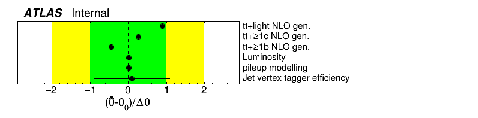
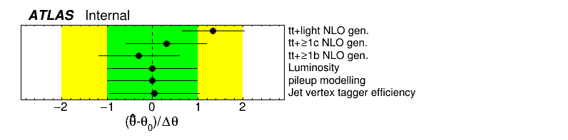

# Removing NP constraint from the likelihood

The fit model, generally speaking, contains two types of parameters: one type does not have any associated constraints implemented in the likelihood, these are the NormFactors and ShapeFactors.
We have sensitivity to them purely from exposing our model to data, and can measure the parameters via their effect on the Poisson terms describing the distribution of data in the likelihood.
The second type of parameters have explicit terms in the likelihood that constrain them, typically called nuisance parameters (NPs).
The constraint terms technically implement (sometimes fictitious) auxiliary measurements that were used to constrain these parameters (see the [HistFactory documentation](https://cds.cern.ch/record/1456844)).
Depending on the context, free-floating parameters may also be called NPs.

In some cases it can be useful to check the model by removing the NP constraint term, i.e. removing the appropriate Gaussian term from the likelihood.
This can be done easily via the config file by setting `IsFreeParameter: TRUE` (default is `FALSE`) for a given `Systematic` block.
This will tell the HistFactory code to not add the Gaussian term for the parameter when building the workspace.
It should be noted that this functionality is rather experimental, as some issues have been observed previously, likely due to the exponential inter(extra)polation for the normalisation component of systematic variations.

!!! warning "Interaction with shape variations"
    The interaction with shape variations (`HistoSys` modifiers in HistFactory) does not work currently.
    When you use `DropNorm` for example, then the fit results do not change whether or not you apply `IsFreeParameter`.
    The origin is currently unknown, this may be a limitation of HistFactory.

## What to expect and when to run this test

When you want to test an impact of a systematic uncertainty that impact only (mostly) normalisation of a given sample, you can also replace the systematic uncertainty with a NormFactor that also has no Gaussian constraint, but it is a more natural object for the likelihood.

Internally in the code, even when you drop the constraint from the likelihood for a given NP, it will be treated as a NP for all the plots, i.e. it will appear in the standard pull plots.
However, when the constraint is dropped, it no longer has any "sigmas" defined.
Furthermore, it has no pre-fit uncertainty defined.
Thus it is perfectly possible that the post-fit uncertainty of the parameter without the Gaussian constraint will be larger than "1 sigma" in the plots (the sigmas here represent only the input histogram, but there is no term in the likelihood that constrains the values of the NP).

Usually the test is relevant when you see that with the default setup (constraint term in the likelihood) the fit results in smaller post-fit uncertainty than pre-fit uncertainty for a given NP.
This means that the initial systematic variation in the model is larger than data allows.
This also means even when the Gaussian term in the likelihood is dropped, the post-fit uncertainty should not be significantly larger.
If the NP is also pulled in the default setup, this raises the question if further (larger) pull is not present since it is already at its optimal value with respect to data or a further pull is prevented by the Gaussian term in the likelihood (pulling it even further causes penalty in the likelihood).
This hypothetical scenario is an ideal case where the Gaussian constraint can be dropped from the likelihood to test the magnitude of the pull.

!!! warning "Interactions with the NuisanceParameter setting"
    There was a bug in the interaction between `IsFreeParameter` and `NuisanceParameter`, fixed by [#856](https://gitlab.cern.ch/TRExStats/TRExFitter/-/merge_requests/856).
    Use versions newer than `TRExFitter-00-04-12` to have this fixed.

## Example

To demonstrate the functionality, we will use a config file from our CI tests: `test/configs/FitExampleNtuple.config`.
Firstly, run the standard fit that reads the ntuples

```bash
trex-fitter nwf test/configs/FitExampleNtuple.config
```

And focus on the pull plot (see below).


The `tt+light NLO gen.` NP i pulled to around one sigma.
We can test now if further pull is prevented by the Gaussian term or data.
Add the following line to the config file for the `Systematic: "ttlight_Gen"` block.
```
IsFreeParameter: TRUE
```

Rerun the fit, also re-creating the workspace (this is required, because the constraint term is specified in the workspace!).
```bash
trex-fitter wf test/configs/FitExampleNtuple.config
```

Now, let us have a look at the same pull plot again (see below).


As you can see, the pull is even larger now that the constraint from the likelihood is removed.
This tells us that data would prefer even larger variation, but the Gaussian term prevents it.
Furthermore, fitted values and uncertainties of other parameters have changed.
This is not surprising since we modified the model.
