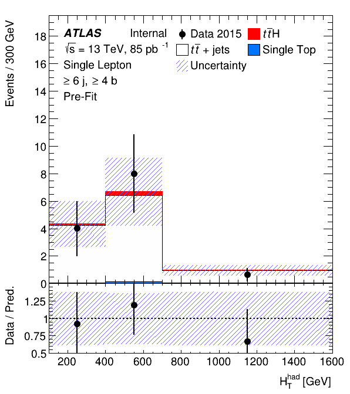
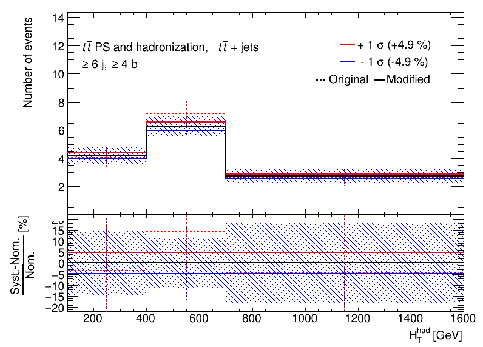
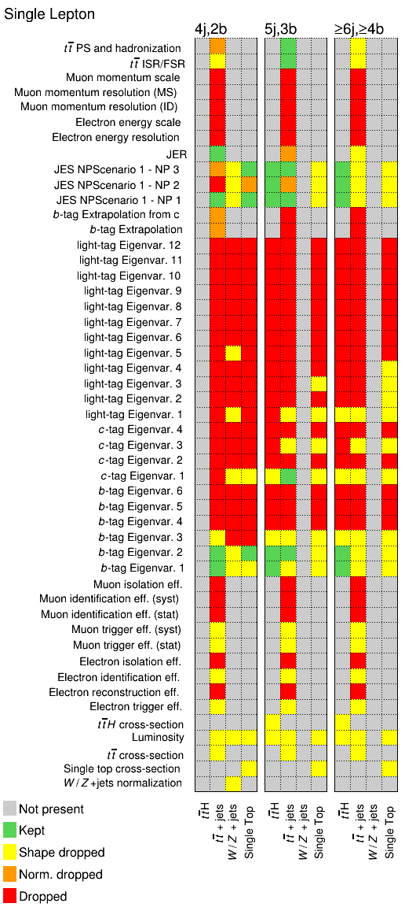
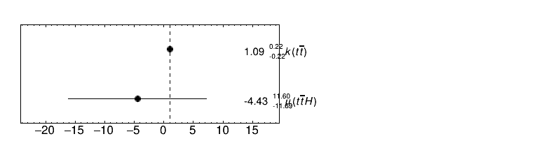
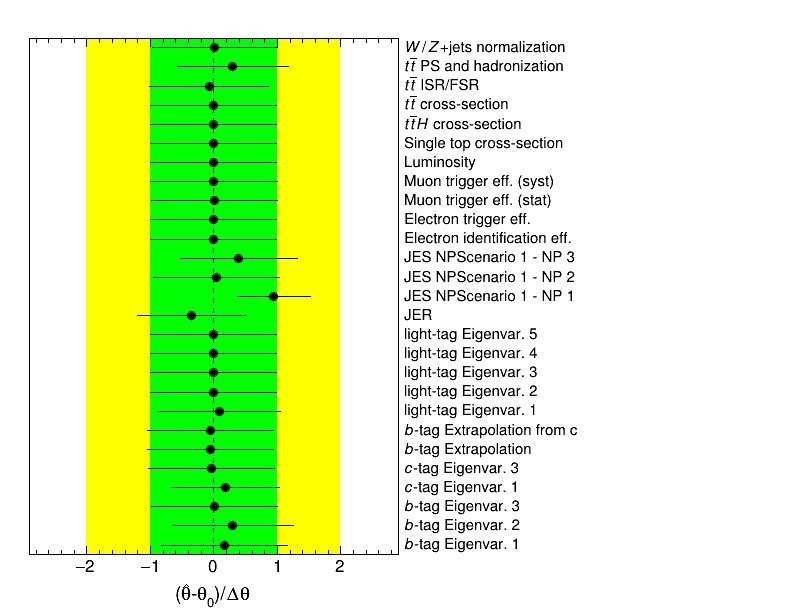
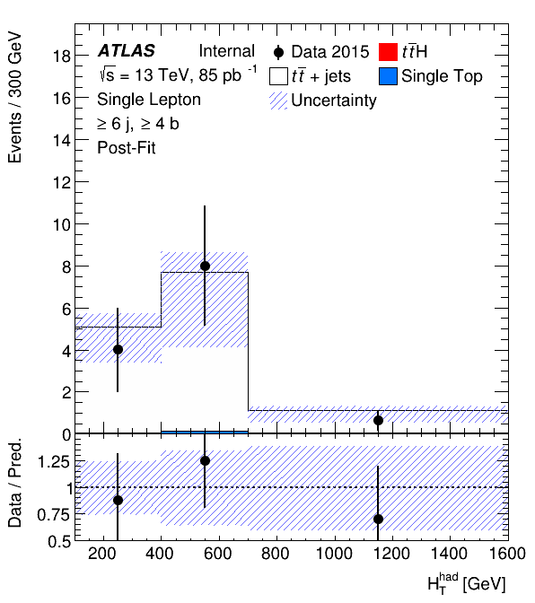
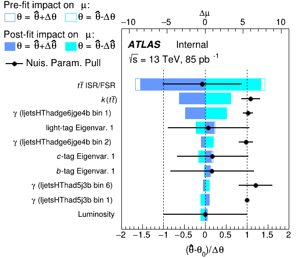
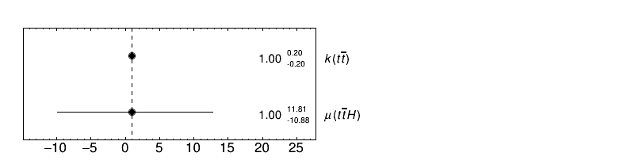

# A short walkthrough of a TRExFitter workflow

The following example shows a common `TRExFitter` workflow.
This example closely follows [these slides](https://indico.cern.ch/event/700646/contributions/2936548/attachments/1627872/2595678/TRExFitterTutorial.pdf), starting on page 24.
Feel free to take a look at them as well.

A lot of information about profile likelihood fits can be found in the [ATLAS Statistics Forum FAQ](https://twiki.cern.ch/twiki/bin/view/AtlasProtected/ATLASStatisticsFAQNew#Profile_likelihood_approach), another [Statistics Forum FAQ](https://twiki.cern.ch/twiki/bin/viewauth/AtlasProtected/ATLASStatisticsFAQ), and the [Profile likelihood method: guidelines and help](https://twiki.cern.ch/twiki/bin/viewauth/AtlasProtected/Profilelikelihood) twiki page.

We need `afs` access for this tutorial, you can run it for example on lxplus.
Start out by getting the code and compiling it, see the [setup](../setup) for instructions.
We will be using the tag `TRExFitter-00-04-10`.


## The config file

The configuration file this example is based on can be found in the `TRExFitter` repository, at `config/ttH2015_ljets.config`.
Open this in the text editor of your choice.
It includes a very simple fit model for a ttH(bb) search using 2015 data in the l+jets channel.
Note the different blocks defined:

- `Job`: general options, for example:
    - `NtuplePaths`: path to the inputs to use (we are using ntuples here)
    - `MCweight`: weights to apply to MC
    - `Selection`: pre-selection to apply
- `Fit`: type of fit to perform
- `Limit`: settings to obtain a limit
- `Region`: These blocks specify which regions enter the fit.
  Note that while there is only one instances of all the previous blocks, there can be multiple regions, and each has a unique name (for example `ljets_HThad_4j2b`).
  There are a few important options:
    - `Type` can be `CONTROL` / `SIGNAL` / `VALIDATION`.
      `CONTROL` and `SIGNAL` will both enter the fit, as we specified it as `CRSR` (only `CONTROL` regions enter a `CRONLY` fit).
      `VALIDATION` regions do not enter the fit, but you-an use them to examine the post-fit modelling of variables.
    - `Variable` specifies which variable to use, you can also put the binning here, but in this case the binning is handled via the `Binning` option.
    - `NtuplePathSuff` is appended to the `NtuplePaths` option in the `Job` block when the framework looks for the root files to build histograms for this region.
- `Sample`: Just as for regions, there can be many samples, which will be used to build the fit model.
  A few important options:
    - `Type`: We have one sample for data with the corresponding type, one `SIGNAL` and a few `BACKGROUND` type samples.
      All of these will enter in every region, unless we specify otherwise.
    - `NtupleFile`: This is the name of the `.root` file containing this sample.
      For this configuration, the framework will build together the full path to a root file by combining the path specified in `NtuplePaths`, the region-specific `NtuplePathSuff` and the sample-specific `NtupleFile` (with a `.root` added at the end).
      Take a look at `afs` to convince yourself that indeed doing so will lead you to a root file for each combination of region and sample.
- `Systematic`: The blocks here specify systematic effects to be considered in the fit.
  There can again be many, each with a unique name.
  Take a look at the syntax here, you can define multiple systematics in one block.
  A few important options to highlight:
    - `Type`: `OVERALL` denotes systematics concerning the overall normalization of samples, `HISTO` are effects like detector systematics built from reading other root files or other trees in ntuples (see e.g. option `NtupleFileSufUp`) or considering additional weights (see e.g. `WeightSufUp`).
    - `Samples`: specifies the `Sample` a given systematic acts on.
    Note how detector systematics like `BTag_B_NP1` act on all (non-data) samples, while the `tt_Shower` systematic only acts on the ttbar sample.
    - `Smoothing`: applies smoothing to the shapes of the systematic effects via this option


## Input histogram production

Time to get started.
First of all, we need to read the ntuples on `afs` and turn them into histograms for further use within the framework.
To do so, we make use of the `n` action:

```bash
trex-fitter n config/ttH2015_ljets.config
```

This should take a few seconds to run.
You will find that a new folder was created, with the same name as the `Job` block in the config file.
This folder will create everything we are going to produce with this config.
Take a look at the `Histograms/` folder within, it contains the histograms needed for everything we specfied in the config.
You will also have noticed that there was a warning when running the step - we have a bin with no events from one sample.
A protection kicks in here and sets the yield of the samples to a small but finite value.
In practice, it is a good idea to avoid these issues.
You can for example group multiple samples together, or use a different binning.


## Producing the first plots

Next up, we are going to visualize the regions we want to fit.
Run the `d` action next to produce pre-fit plots:

```bash
trex-fitter d config/ttH2015_ljets.config
```

A few new things have now been created, take a look at the content of the `ttH2015_ljets/` folder again:

- the two plots `PieChart.png` and `SignalRegions.png` show you background composition and fraction of signal in the regions you defined
- the `Plots/` folder contains one plot showing data and MC per region you defined, as well as summary plots
- the `Tables/` folder contains various tables in text or `.tex` format, showing you for example the yields per sample and per region

The plots produced include the effects from all systematics sources specified in the config in the bands drawn.
As an example, here is the plot of the signal region:



!!! tip "Getting more output"
    There was very little output from `TRExFitter` while running the actions so far.
    Time to change this!
    Locate the `DebugLevel` option in the config and increase it to `1` or `2`.
    Try re-running the steps above and see what happens!

!!! info "Blinding"
    You might not want to plot data in signal-enriched bins.
    Take a look at the `BlindingThreshold` option for that purpose!

!!! info "Binning"
    `TRExFitter` includes several algorithms to automatically bin distributions, particularly useful if you want to fit any MVA output distribution.
    Take a look at the `AutoBin` argument for the `Binning` option.
    Some documentation on the algorithms can be found in thse slides: [TransfoD, TransfoF](https://indico.cern.ch/event/455289/contributions/1953694/attachments/1209081/1762963/Calvet_binning_Htop_160108.pdf), [TransfoJ](https://indico.cern.ch/event/472696/contributions/1992693/attachments/1217431/1778326/Keller16-01-26.pdf).

We will now take a closer look at all the systematic uncertainties included in this fit.
Locate the `SystControlPlots` option in the `Job` block and set it to `TRUE`.
Afterwards, re-run the `n` action (alternatively, since we just want to produce some plots, you can also use the `b` action here).
Take a look at the `ttH2015_ljets/` folder again, there is now a sub-folder `Systematics/`, containing the effect of all systematics defined in the config.
Try to locate the plot showing you the effect of the ttbar shower systematic in the signal region.
It should look like this:



The dashed line shows the actual shape of the events contained in the `ttbar_pyt8.root` sample used.
The solid red line shows the shape of the systematic after smoothing.
The blue line shows you the symmetrized effect of varying the systematic in the opposite direction (look at the `Symmetrisation` option).
It is important to look at these plots to see the effect of smoothing.
Some technical details about smoothing (and also pruning, described in the next section) can be found in these [slides by Spyros Argyropoulos](https://indico.cern.ch/event/691683/contributions/2873279/attachments/1593521/2522846/PruningSmoothing.pdf).

!!! question "A closer look at smoothing"
    The `SystErrorBars` (enabled by default) controls whether the above plot shows statistical uncertainties.
    Take a look at the plot - does the smoothing look reasonable within the statistical uncertainties shown?
    There is a range of smoothing algorithms available, but no algorithm should be used blindly.
    It is important to check these plots to verify that they do not look unphysical.


## Creating the workspace

Time to run the next action, this time producing a workspace containing our fit model:

```bash
trex-fitter w config/ttH2015_ljets.config
```

A new sub-folder has appeared: `RooStats/`.
Take a look at the files inside, they contain all the information for HistFacory to build the fit model.
Note how there is no file for the `VALIDATION` region, as it does not enter the fit.

Besides that folder, there are also a few new files containing information about the pruning that took place.
Take a look at the `SystPruningShape` and `SystPruningNorm` options, they are used to neglect systematic sources with small impact.
This will simplify our fit model.
The `Pruning.png` plot can also help identify issues coming from finite statistics in your inputs.
Below you can see the plot:



It shows which systematics effects act on each sample, for each region.
It also shows you whether they survived the pruning or not.
You can add the `KeepPruning: TRUE` option to your `Job` block to skip all pruned systematics next time you run the framework (after the `w` action has been used at least once).

!!! question "Tuning the pruning"
    How does the pruning change when you modify the `SystPruningShape` and `SystPruningNorm` options?
    Also have a look at the effect of `SystLarge`.


## Running a fit

We are now ready to run a fit.
For this, use the `f` action:

```bash
trex-fitter f config/ttH2015_ljets.config
```

Various things have been produced:

- new plots in the `ttH2015_ljets/` folder:
    - a correlation matrix `CorrMatrix.png`, which only contains nuisance parameters if they have a correlation with another nuisance parameter above the `CorrelationThreshold`.
    - the best-fit results for all gammas, encoding the effects of finite MC statistics, found in the `Gammas.png` plot
    - the best-fit results for all `NormFactor` in `NormFactors.png`
    - the best-fit results for all nuisance parameters specified as `Systematic` (and not fully pruned), in `NuisPar.png`.
- the `Fits/` sub-folder contains a text file with the best-fit results and associated uncertainties for all parameters, as well as their correlations

The following plot shows you the result for the fit we performed, including the best-fit value for the parameter we ultimately want to extract, the ttH signal strength $\mu_{t\bar{t}H}$:



!!! tip "Background-only fits"
    Try performing a fit without signal included ("background-only"), for this you need to change the `FitType` option in the `Fit` block.

You can also find the plot showing you the best-fit values and associated uncertainties for all systematics below (for the fit including signal):




## Post-fit plots

Time to see how our model describes data after the fit has been done.
We use the `p` option to produce post-fit plots:

```bash
trex-fitter p config/ttH2015_ljets.config
```

The `Plots/` and `Tables/` subfolders now contain some new files, showing you the post-fit version corresponding to the existing pre-fit plots and tables produced previously with the `d` action.
Try locating the post-fit signal region plot, it should look like this:



This plot shows you the model with best-fit results for all nuisance parameters applied, including the total uncertainty calculated taking all correlations into account.
The post-fit effect of gammas is not propagated to the plots by default, but you can enable it by adding `UseGammaPulls: TRUE` to your `Job` block.
You will also notice that the plot above has no visible red signal contribution anymore.
This is because our best-fit signal strength is negative.
Take a look at the `VALIDATION` region plot as well.
Even though this region was not included in the fit, you can still see the fit results applied to this region in the corresponding plot.


## Limits and significance

Going one step further, we can calculate the expected and observed upper limits on the ttH signal strength with the `l` action:

```bash
trex-fitter l config/ttH2015_ljets.config
```

Take a look at the file `myLimit_CL95.root` (which is located in the `Limits/asymptotics/` sub-folder) to see the results in the `stats` tree.
If you would like to inject a signal into your limit calculation, add `SignalInjection: TRUE` to the `Limit` block.
The limit calculation is using the $CL_S$ method, you can find a brief description of it [here](https://www.pp.rhul.ac.uk/~cowan/stat/cls/CLsInfo.pdf), or more details following the links at the beginning of this tutorial.
See the [limit feature explanation](inference/limit) page for more information.

To calculate the observed and expected significance, use the `s` action:

```bash
trex-fitter s config/ttH2015_ljets.config
```

Again, a new sub-folder has been created, this time named `Significance/asymptotics`.
It contains the file `mySignificance_p0.root`, with the results of the calculation stored within the `p0` tree.
See also the [significance feature explanation](inference/significance) page.


## Ranking plot

To see which nuisance parameter has the largest impact on the uncertainty of our signal strength, we make use of the `r` action.
Note that this can take a while, since many different fits are required, especially for complex fit configurations.
In this case, this step can be parallelized (see the [TRExFitter readme](https://gitlab.cern.ch/TRExStats/TRExFitter/blob/master/README.md) for more information on this).
For this tutorial, you can run them all at once:

```bash
trex-fitter r config/ttH2015_ljets.config
```

While this is running, here is some more information of what is happening: For each nuisance parameter, we perform four fits.
The specific nuisance parameter is fixed to one of these configurations per fit:

- pre-fit value + pre-fit uncertainty
- pre-fit value - pre-fit uncertainty
- post-fit value + post-fit uncertainty
- post-fit value - post-fit uncertainty

We then calculate the "impact on $\mu$" as the difference between the signal strength obtained in each of these four fits and the signal strength obtained in the nominal fit (which we ran in the `f` action).

A few new things are created in this step.
The `ttH2015_ljets/` folder contains a few plots showing you the ranking for `Systematic` parameters (`RankingSysts.png`), gammas (`Ranking.png`), and both combined (`Ranking.png`).
The amount of entries in the plot depends on the `RankingMaxNP` option.
The fit results from the fits performed are also added to the `Fits/` folder, specifically if the ranking is parallelized.
The `Ranking.png` plot is shown below:




## Asimov dataset

To conclude this tutorial, we are going to perform a fit to an Asimov dataset.
This dataset is built from the exact prediction of signal and background in every bin, and it is very useful in evaluating our fit model before fitting data.
In order to fit the Asimov dataset, add `FitBlind: TRUE` to the `Fit` block.
Afterwards, re-run the fit with the `f` action.
Take a look at all the things produced by the step (see the [Running a fit](#running-a-fit) section for details).
What has changed?
The fit results for normalization factors are shown below:



As expected from the Asimov dataset, the best-fit result for the normalization factors is just their nominal value.

!!! question "Comparing fits"
    What else has changed?
    Compare also the best-fit values for nuisance parameters and gammas, and repeat the ranking procedure.
    How do the results compare to the fit to data?


## Further steps and advanced techniques

There are many things we have not covered in this tutorial.
Have a look at the available options in the [TRExFitter readme](https://gitlab.cern.ch/TRExStats/TRExFitter/blob/master/README.md) to learn about additional features.
See also the rest of the webpage for more.
If you run into issues, have questions or want to report bugs, please make use of the mailing list [atlas-phys-stat-tthfitter](https://e-groups.cern.ch/e-groups/EgroupsSubscription.do?egroupName=atlas-phys-stat-tthfitter) or use the [TRExFitter JIRA](https://its.cern.ch/jira/browse/TTHFITTER/).

If you would like to try out some of the additional features the framework offers, you can also have a look at [these slides](https://indico.cern.ch/event/700646/contributions/2936548/attachments/1627872/2595678/TRExFitterTutorial.pdf), starting from slide 43.
They deal with topics such as:

- additional command line options
- parallelized input creation
- fixed nuisance parameters
- stat-only fits
- contribution of a group of nuisance parameters to the uncertainty of the parameter of interest
- parallelized fitting
- ghost samples
- custom Asimov dataset generation
- goodness of fit
- $\chi^2$ for data/MC plots
- combined fits
- systematics (de-) correlation, shape systematics
- treatment of finite MC statistics
- `NormFactor` correlations
- template fits and morphing
- bootstrapping
